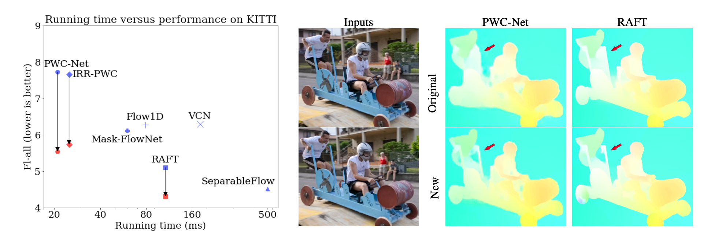
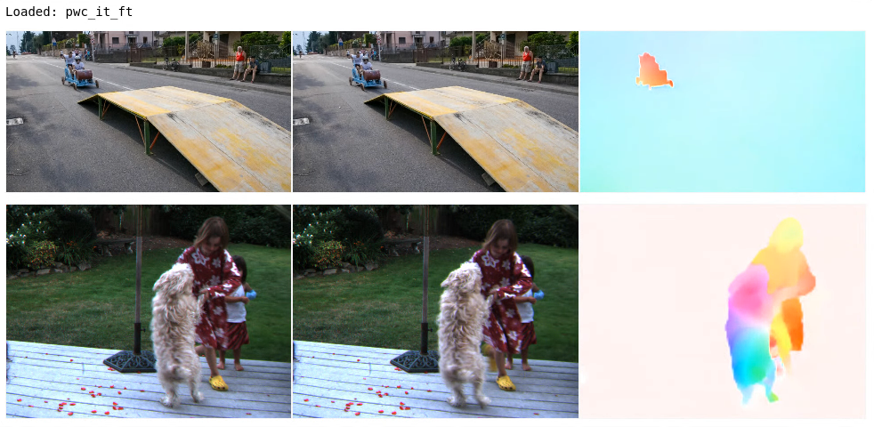

# Optical Flow by Google Research VisCam

## Papers

Dataset, code, and checkpoints for two optical flow papers from Google Research
Viscam. <br>

[What Makes RAFT Better Than PWC-Net?](https://arxiv.org/pdf/2203.10712v1.pdf) <br />
[Deqing Sun](https://deqings.github.io/)<sup>\*,T</sup>, [Charles Herrmann](https://scholar.google.com/citations?user=LQvi5XAAAAAJ&hl=en)<sup>\*</sup>, [Fitsum Reda](https://fitsumreda.github.io/), [Michael Rubinstein](http://people.csail.mit.edu/mrub/), [David Fleet](https://www.cs.toronto.edu/~fleet/), [William T. Freeman](https://billf.mit.edu/)<br />
Google Research<br />
In ECCV 2022. <sup>*</sup> denotes equal technical contribution, <sup>T</sup> denotes project lead. <br>

[AutoFlow: Learning a Better Training Set for Optical Flow](https://arxiv.org/pdf/2104.14544.pdf) <br />
[Deqing Sun](https://deqings.github.io/), [Daniel Vlasic](https://people.csail.mit.edu/drdaniel/) , [Charles Herrmann](https://scholar.google.com/citations?user=LQvi5XAAAAAJ&hl=en), [Varun Jampani](https://varunjampani.github.io/), [Michael Krainin](https://research.google/people/107089/), [Huiwen Chang](https://scholar.google.com/citations?user=eZQNcvcAAAAJ&hl=en), [Ramin Zabih](https://www.cs.cornell.edu/~rdz/), [William T. Freeman](https://billf.mit.edu/), [Ce Liu](https://people.csail.mit.edu/celiu/) <br />
Google Research<br />
In CVPR 2021.

 Left: Large improvements with newly
trained PWC-Net, IRR-PWC and RAFT (left: originally published results in blue;
results of our newly trained models in red). The newly trained RAFT is more
accurate than all published methods on KITTI 2015 at the time of writing. Right:
Visual comparison on a Davis sequence between the original [43] and our newly
trained PWC-Net and RAFT, shows improved flow details, e.g. the hole between the
cart and the person at the back. The newly trained PWC-Net recovers the hole
between the cart and the front person better than RAFT.

## Inference

### Pre-trained Models

Create a directory where you can keep large files. Ideally, not in this
directory.

```
> mkdir <pretrained_models>
```

Download pre-trained TF2 Saved Models from
[google drive](https://drive.google.com/drive/folders/1I2hli8O9NST-uu7RxcpLk38k2KnTDcHe?usp=sharing)
and put into `<pretrained_models>`.

The downloaded folder should have the following structure:

```
pretrained_models/
├── eccv_disentangling_model_and_train/
│   ├── pwc_it_pre/
│   ├── pwc_it_ft/
```

### Running the optical flow network

To run inference on examples frames we will use the
"OpticalFlow-Inference.ipynb" colab in colabs/. To run the colab, make sure that
you have installed all the required packages with the following command.

```
> pip install -r requirements.txt
```

Then make sure you have the pre-trained models downloaded to the correct folder
as shown in the section above. Then start a colab kernel using the follow
command.

```
> jupyter notebook --NotebookApp.allow_origin='https://colab.research.google.com' --port=8888   -NotebookApp.port_retries=0
```

Then navigate to the "OpticalFlow-Inference.ipynb" and run all the cells.

 Example of retrained
PWC-Net from our most recent submission (run in this inference colab)

## Training

The src/ directory currently contains the augmentation module (the Improved
Training result uses the "pwc" augmentation from the augmentations module). The
full train loop will posted soon.

## Citation

If you find this useful in your works, please acknowledge it appropriately by
citing:

```
@inproceedings{sun2021autoflow,
  title={Autoflow: Learning a better training set for optical flow},
  author={Sun, Deqing and Vlasic, Daniel and Herrmann, Charles and Jampani, Varun and Krainin, Michael and Chang, Huiwen and Zabih, Ramin and Freeman, William T and Liu, Ce},
  booktitle={Proceedings of the IEEE/CVF Conference on Computer Vision and Pattern Recognition},
  pages={10093--10102},
  year={2021}
}
```

```
@article{sun2022makes,
  title={What Makes RAFT Better Than PWC-Net?},
  author={Sun, Deqing and Herrmann, Charles and Reda, Fitsum and Rubinstein, Michael and Fleet, David and Freeman, William T},
  journal={arXiv preprint arXiv:2203.10712},
  year={2022}
}
```

Contact: Deqing Sun (deqingsun@google.com) and Charles Herrmann
(irwinherrmann@google.com)

## Coding style

*   2 spaces for indentation
*   80 character line length
*   PEP8 formatting

## Disclaimer

This is not an officially supported Google product.
